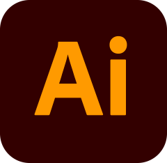

<h1 align="center">Hi, I'm Vas Sharma</h1>

<h4> I’m a product designer with a focus on UI,UX and visual design.  With 8+ years of experience, I take products from the ideation stage to the launch stage.</h4>

- I have worked on a variety of projects which include, AI, Edutech, Environment, College Safety and Intersex Community. I have also designed products based on OCR, automated scheduling and data management.

- I’m currently learning: Deutsch (B1)

- Visit my website: [https://www.vas-sharma.design](https://www.vas-sharma.design)

- Email me at: <a href="mailto:vasundhara.14@gmail.com?subject=Reaching out via GitHub">vasundhara.14@gmail.com</a>

- Or schedule a meeting directly: [Calendly](https://calendly.com/meet-vas/1hour)

<h3 align="left">Connect with me:</h3>
 . 
 . 

<h3 align="left">Tools I Use:</h3>
 . 
 . 
 . 
 . 
 . 
 . 
 . 
 . 
 . 
 . 
 . 

<h3 align="left">Spoken Languages:</h3>

- English: Native language
- German: A2
- Hindi: Native language
